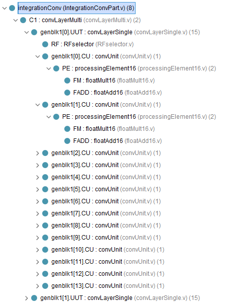
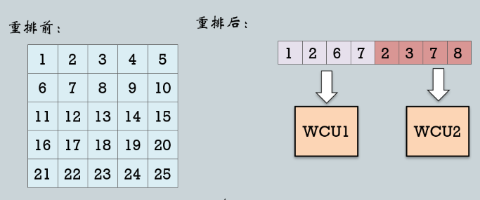

# 卷积层：代码层次与解析

## 1. 卷积层层次


## 2. 卷积层代码<font color=Red>（自底向上）</font>

### 2.1. Processing Element

```verilog
module processingElement16(clk,reset,floatA,floatB,result);

parameter DATA_WIDTH = 16;  // 数据类型float16

input clk, reset;
input [DATA_WIDTH-1:0] floatA, floatB; // 输入float16数据A和B
output reg [DATA_WIDTH-1:0] result;  // 输出float16数据
wire [DATA_WIDTH-1:0] multResult;
wire [DATA_WIDTH-1:0] addResult;

floatMult16 FM (floatA,floatB,multResult); // float16乘法运算
floatAdd16 FADD (multResult,result,addResult);// float16加法运算

always @ (posedge clk or posedge reset) begin
    if (reset == 1'b1) begin
        result = 0;    // 开始时，result赋值为0
    end else begin
        result = addResult;  // 求和结果不断更新为result，即为累加操作，result作为最后的输出
    end
end

endmodule

```

### 2.2. Convolution Unit
循环使用PE完成一个窗口的卷积计算，27个周期后，得到数组


```verilog
module convUnit(clk,reset,image,filter,result);

parameter DATA_WIDTH = 16;  //数据宽度，float16
parameter D = 1; //卷积核深度
parameter F = 5; //卷积核大小

input clk, reset;
input [0:D*F*F*DATA_WIDTH-1] image, filter; //[0:399] image输入
output [0:DATA_WIDTH-1] result;  //[0:15] result输出
reg [DATA_WIDTH-1:0] selectedInput1, selectedInput2;

integer i;

processingElement16 PE
    (
        .clk(clk),
        .reset(reset),
        .floatA(selectedInput1),
        .floatB(selectedInput2),
        .result(result)
    );

// 卷积以顺序方式计算，以节省硬件
// 元素矩阵乘法的结果在 (F*F+2) 个周期后完成（1个周期用于重置复位，1个周期用于输出元素，F*F 个周期用于累积 F*F 乘法的结果）
always @ (posedge clk, posedge reset) begin
    if (reset == 1'b1) begin // reset
        i = 0;
        selectedInput1 = 0;
        selectedInput2 = 0;
    end else if (i > D*F*F-1) begin //如果卷积已完成，但我们仍在等待其他块完成，则将第二个零置为卷积单元（在流水线的情况下）
        selectedInput1 = 0;
        selectedInput2 = 0;
    end else begin //发送图像部分的一个元素和过滤器的一个元素进行相乘和累加
        selectedInput1 = image[DATA_WIDTH*i+:DATA_WIDTH];
        selectedInput2 = filter[DATA_WIDTH*i+:DATA_WIDTH];
        i = i + 1;
    end
end

endmodule
```

### 2.3. RFselector
用于从输入图像中提取相应5*5的子矩阵，并将这些子矩阵（一维数组），数据重排输出数组receptiveField中，再对应分发给n个（横向卷积并行度）CU进行窗口卷积



```verilog
`timescale 100 ns / 10 ps
//此模块将图像、行号和列号作为输入
//它用要发送到卷积单元的图像各部分的矩阵填充输出数组
module RFselector(image,rowNumber, column,receptiveField);
parameter DATA_WIDTH = 16;
parameter D = 1; //Depth of the filter
parameter H = 32; //Height of the image
parameter W = 32; //Width of the image
parameter F = 5; //Size of the filter

input [0:D*H*W*DATA_WIDTH-1] image;
input [5:0] rowNumber, column;
output reg [0:(((W-F+1)/2)*D*F*F*DATA_WIDTH)-1] receptiveField; //用于保存要发送到卷积单元的矩阵（图像的各个部分）的数组

//address：计数器，用于填充接受域数组
//c：计数器，用于循环输入图像的列
//k：计数器，用于循环输入图像的深度
//i：计数器，用于循环输入图像的行
integer address, c, k, i;

always @ (image or rowNumber or column) begin
    address = 0;
    if (column == 0) begin //如果列为零，则用与输出图像行（行号）的前半部分像素相对应的图像部分填充数组
        for (c = 0; c < (W-F+1)/2; c = c + 1) begin
            for (k = 0; k < D; k = k + 1) begin
                for (i = 0; i < F; i = i + 1) begin
                    receptiveField[address*F*DATA_WIDTH+:F*DATA_WIDTH] = image[rowNumber*W*DATA_WIDTH+c*DATA_WIDTH+k*H*W*DATA_WIDTH+i*W*DATA_WIDTH+:F*DATA_WIDTH];
                    address = address + 1;
                end
            end
        end
    end else begin //如果列为零，则用与输出图像行（行号）的后半部分像素相对应的图像部分填充数组
        for (c = (W-F+1)/2; c < (W-F+1); c = c + 1) begin
            for (k = 0; k < D; k = k + 1) begin
                for (i = 0; i < F; i = i + 1) begin
                    receptiveField[address*F*DATA_WIDTH+:F*DATA_WIDTH] = image[rowNumber*W*DATA_WIDTH+c*DATA_WIDTH+k*H*W*DATA_WIDTH+i*W*DATA_WIDTH+:F*DATA_WIDTH];
                    address = address + 1;
                end
            end
        end
    end
end

endmodule
```


### 2.4. Single Filter Layer
单层的卷积神经网络，输入图像中使用（RF selector）提取子矩阵，然后通过多个卷积单元（convUnit）对这些子矩阵进行卷积运算，最终生成卷积后的输出图像，生成1个28*28特征图

```verilog

module convLayerSingle(clk,reset,image,filter,outputConv);

parameter DATA_WIDTH = 16;
parameter D = 1; //卷积核的深度
parameter H = 32; //输入图像的高度
parameter W = 32; //输入图像的宽度
parameter F = 5; //卷积核的大小

input clk, reset;
input [0:D*H*W*DATA_WIDTH-1] image;
input [0:D*F*F*DATA_WIDTH-1] filter;
output reg [0:(H-F+1)*(W-F+1)*DATA_WIDTH-1] outputConv; // 模块的输出
wire [0:((W-F+1)/2)*DATA_WIDTH-1] outputConvUnits; // 卷积单元的输出和行选择器的输入
reg internalReset;  //复位卷积单元
wire [0:(((W-F+1)/2)*D*F*F*DATA_WIDTH)-1] receptiveField; // 要发送到卷积单元的矩阵数组

integer counter, outputCounter;
//counter：转换单元完成所需的时钟周期数
//outputCounter：将卷积单元的输出映射到模块的输出的索引
reg [5:0] rowNumber, column; 
//rowNumber: 确定由转换单元计算的行
//column: 确定我们是否计算输出行的第一个或第二个 14 个像素

RFselector
#(
    .DATA_WIDTH(DATA_WIDTH),
    .D(D),
    .H(H),
    .W(W),
    .F(F)
) RF
(
    .image(image),
    .rowNumber(rowNumber),
    .column(column),
    .receptiveField(receptiveField)
);

genvar n;
generate //生成 n 个卷积单元，其中 n 是输出图像一行像素数量的一半，即14个
    for (n = 0; n < (H-F+1)/2; n = n + 1) begin 
        convUnit
        #(
            .D(D),
            .F(F)
        ) CU
        (
            .clk(clk),
            .reset(internalReset),
            .image(receptiveField[n*D*F*F*DATA_WIDTH+:D*F*F*DATA_WIDTH]),
            .filter(filter),
            .result(outputConvUnits[n*DATA_WIDTH+:DATA_WIDTH])
        );
    end
endgenerate

always @ (posedge clk or posedge reset) begin
    if (reset == 1'b1) begin
        internalReset = 1'b1;
        rowNumber = 0;
        column = 0;
        counter = 0;
        outputCounter = 0;
    end else if (rowNumber < H-F+1) begin  //还有未处理的行
        if (counter == D*F*F+2) begin //转换单元在 1*5*5+2 个时钟周期后完成，卷积单元完成了一行的计算
            outputCounter = outputCounter + 1;
            counter = 0;
            internalReset = 1'b1;
            if (column == 0) begin    //处理前半行
                column = (H-F+1)/2;
            end else begin            //处理后半行
                rowNumber = rowNumber + 1;
                column = 0;
            end              
        end else begin   //卷积单元还在处理中
            internalReset = 0;
            counter = counter + 1;
        end
    end
end

always @ (*) begin
    outputConv[outputCounter*((W-F+1)/2)*DATA_WIDTH+:((W-F+1)/2)*DATA_WIDTH] = outputConvUnits;
end

endmodule

```
### 2.5. Multi Filter Layer
通过多个卷积核对输入图像进行卷积运算，生成多个卷积后的输出图像。这些输出图像最终被合并成一个大的输出数组，6个卷积核分为2个一组，循环3次输入到convLaverSingle，即每次执行2个卷积核与图像的卷积

```verilog

module convLayerMulti(clk,reset,image,filters,outputConv);

parameter DATA_WIDTH = 16;
parameter D = 1; //输入图像深度
parameter H = 32; //输入图像高度
parameter W = 32; //输入图像宽度
parameter F = 5; //卷积核尺寸
parameter K = 6; //卷积核数量

input clk, reset;
input [0:D*H*W*DATA_WIDTH-1] image;
input [0:K*D*F*F*DATA_WIDTH-1] filters;
output reg [0:K*(H-F+1)*(W-F+1)*DATA_WIDTH-1] outputConv;
reg [0:2*D*F*F*DATA_WIDTH-1] inputFilters;
wire [0:2*(H-F+1)*(W-F+1)*DATA_WIDTH-1] outputSingleLayers;
reg internalReset;

//索引当前处理的卷积核集合
integer filterSet, counter, outputCounter;

genvar i;  //生成了2个 convLayerSingle 模块，每个模块负责处理一个卷积核
generate
    for (i = 0; i < 2; i = i + 1) begin 
        convLayerSingle #(
          .DATA_WIDTH(DATA_WIDTH),
          .D(D),
          .H(H),
          .W(W),
          .F(F)
        ) UUT 
        (
            .clk(clk),
                .reset(internalReset),
                .image(image),
                .filter(inputFilters[i*D*F*F*DATA_WIDTH+:D*F*F*DATA_WIDTH]),
                .outputConv(outputSingleLayers[i*(H-F+1)*(W-F+1)*DATA_WIDTH+:(H-F+1)*(W-F+1)*DATA_WIDTH])
            );
    end
endgenerate

always @ (posedge clk or posedge reset) begin
    if (reset == 1'b1) begin
        internalReset = 1'b1;
        filterSet = 0;
        counter = 0;
        outputCounter = 0;      
    end else if (filterSet < K/2) begin  //处理当前卷积核集合，整个处理过程会进行3次迭代，每次迭代处理2个滤波器，直到所有6个滤波器都被处理完毕
        if (counter == ((((H-F+1)*(W-F+1))/((H-F+1)/2))*(D*F*F+3)+1)) begin  //当前卷积核集合处理完成
            outputCounter = outputCounter + 1;
            counter = 0;
            internalReset = 1'b1;
            filterSet = filterSet + 1;
        end else begin   //处理未完成
            internalReset = 0;
            counter = counter + 1;
        end
    end
end

always @ (*) begin
    inputFilters = filters[filterSet*2*D*F*F*DATA_WIDTH+:2*D*F*F*DATA_WIDTH];  //输入滤波器
    outputConv[outputCounter*2*(H-F+1)*(W-F+1)*DATA_WIDTH+:2*(H-F+1)*(W-F+1)*DATA_WIDTH] = outputSingleLayers;  //输出映射
end

endmodule

```
### 2.6. IntegrationConv
```verilog
module integrationConv (clk,reset,CNNinput,Conv,ConvOutput);

parameter DATA_WIDTH = 16;
parameter ImgInW = 32;
parameter ImgInH = 32;
parameter ConvOut = 28;
parameter Kernel = 5;
parameter DepthC = 6;

input clk, reset;
input [ImgInW*ImgInH*DATA_WIDTH-1:0] CNNinput;
input [Kernel*Kernel*DepthC*DATA_WIDTH-1:0] Conv;
output [ConvOut*ConvOut*DepthC*DATA_WIDTH-1:0] ConvOutput;

convLayerMulti C1
(
    .clk(clk),
    .reset(reset),
    .image(CNNinput),
    .filters(Conv),
    .outputConv(ConvOutput)
);

endmodule
```

