# 卷积层：功能层次与解析

## 1. 层次设计（自顶向下）

### 1.1. Multi Filter Layer
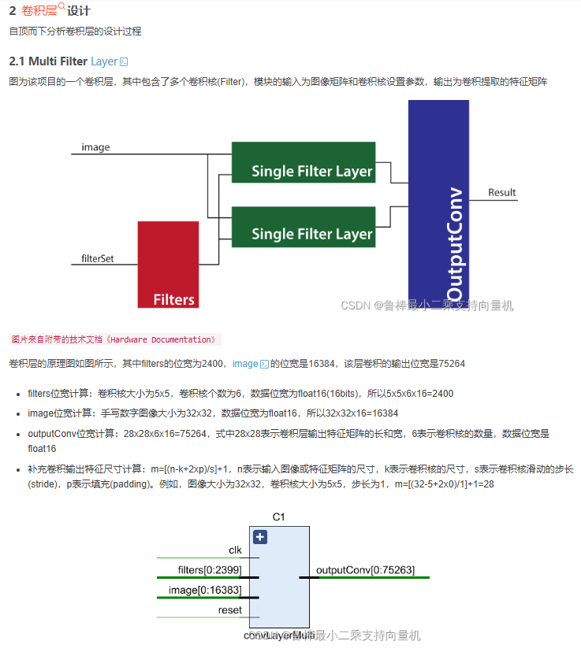
### 1.2. Single Filter Layer
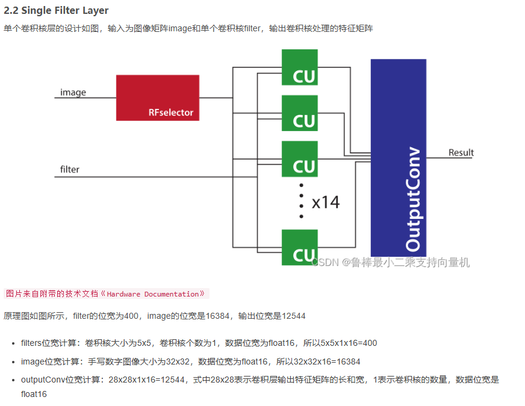
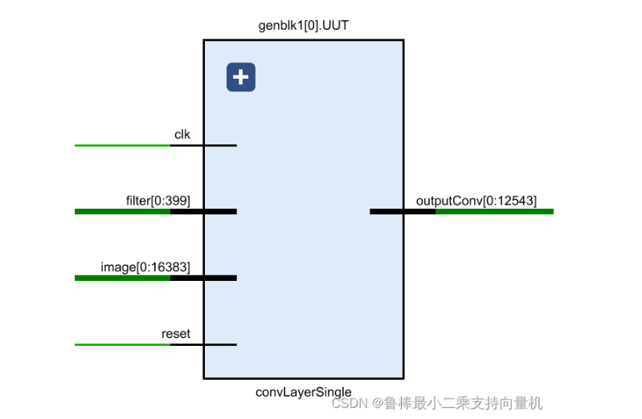
### 1.3. Convolution Unit
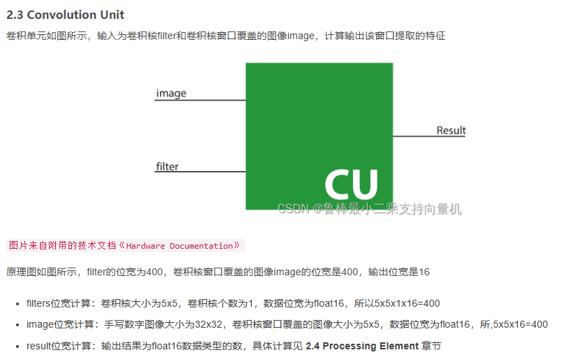
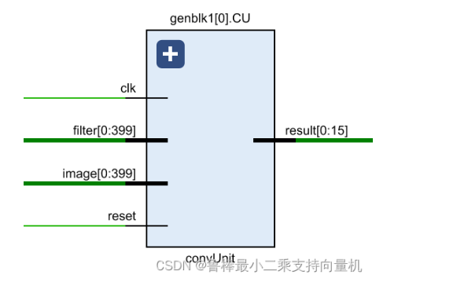
### 1.4. Processing Element
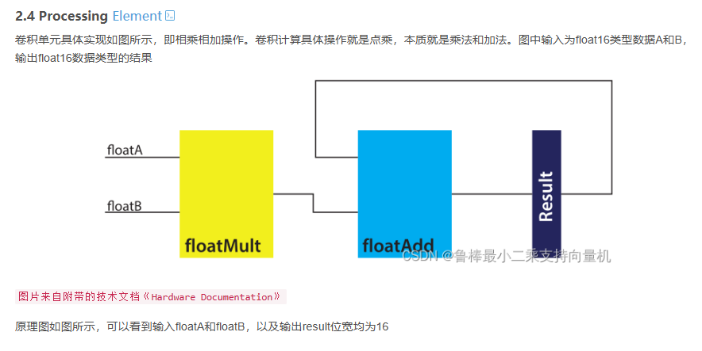
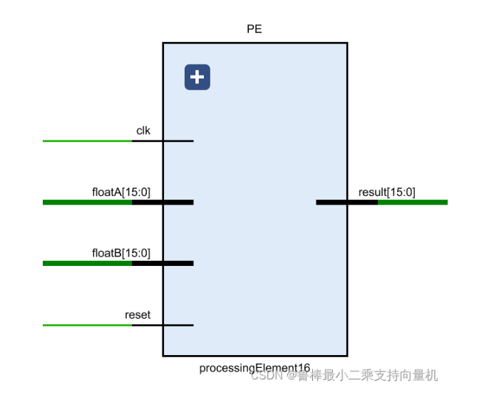

## 2. 模块功能解析（自底向上）

### 2.1. Processing Element
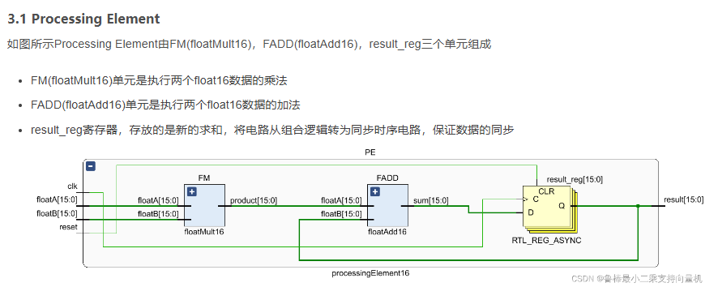
### 2.2. Convolution Unit
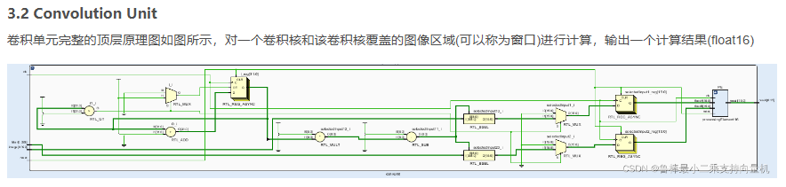
### 2.3. Single Filter Layer
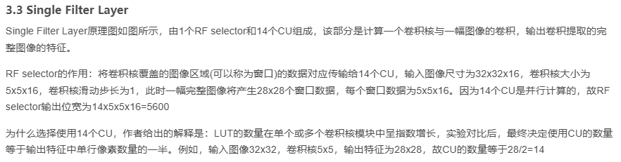
### 2.4. Multi Filter Layer
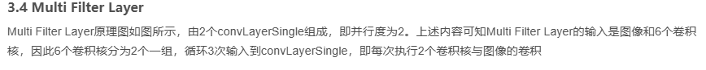