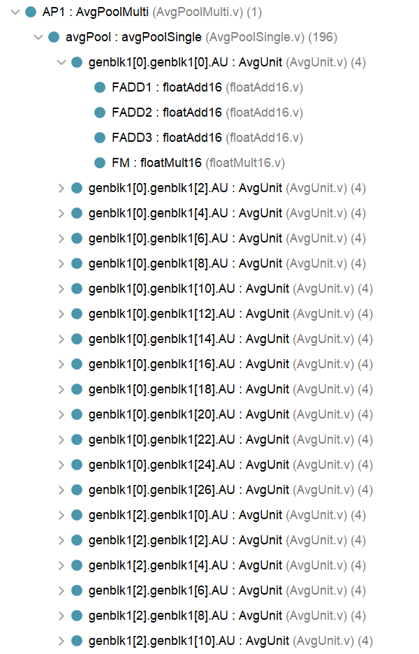

# 池化层：代码层次与解析

## 1. 池化层层次



## 2. 池化层代码<font color=Red>（自底向上）</font>

### 2.1. AvgUnit

计算输入4个数的均值

```verilog
module AvgUnit (numA,numB,numC,numD,AvgOut);
  
parameter DATA_WIDTH = 16;

input [DATA_WIDTH-1:0] numA,numB,numC,numD;
output [DATA_WIDTH-1:0] AvgOut;

wire [DATA_WIDTH-1:0] add1result;
wire [DATA_WIDTH-1:0] add2result;
wire [DATA_WIDTH-1:0] add3result;

// 0.25
reg [DATA_WIDTH-1:0] quarter = 16'b0011010000000000;

floatAdd16 FADD1 (numA,numB,add1result);
floatAdd16 FADD2 (add1result,numC,add2result);
floatAdd16 FADD3 (add2result,numD,add3result);  
floatMult16 FM (add3result,quarter,AvgOut);  

endmodule

```


### 2.2. AvgPoolSingle

1、执行单个通道的image的平均池化，这里为全并行度，每个2 * 2窗口就是一个AU
2、一层AvgPoolSingle包含14 * 14 = 196个AU，生成一个14 * 14的特征图

```verilog
module AvgPoolSingle(aPoolIn,aPoolOut);
  
parameter DATA_WIDTH = 16;
parameter InputH = 28;
parameter InputW = 28;
parameter Depth = 1;

input [0:InputH*InputW*Depth*DATA_WIDTH-1] aPoolIn;
output [0:(InputH/2)*(InputW/2)*Depth*DATA_WIDTH-1] aPoolOut;

genvar i,j;

generate  // 2x2的池化窗口 生成了14 * 14 = 196个AU
  for (i=0; i<(InputH); i=i+2) begin
    for (j=0; j<(InputW); j=j+2) begin
    AvgUnit
    #(
     .DATA_WIDTH(DATA_WIDTH)
     )
     AU
    (
      .numA(aPoolIn[(i*InputH+j)*DATA_WIDTH+:DATA_WIDTH]),
      .numB(aPoolIn[(i*InputH+j+1)*DATA_WIDTH+:DATA_WIDTH]),
      .numC(aPoolIn[((i+1)*InputH+j)*DATA_WIDTH+:DATA_WIDTH]),
      .numD(aPoolIn[((i+1)*InputH+j+1)*DATA_WIDTH+:DATA_WIDTH]),
      .AvgOut(aPoolOut[(i/2*InputH/2+j/2)*DATA_WIDTH+:DATA_WIDTH])
      );
    end
  end
endgenerate

endmodule
```

### 2.3. AvgPoolMulti

执行6个通道image的平均池化，并行度为1，循环复用6次AvgPoolSingle完成6个通道的平均池化

```verilog
module AvgPoolMulti(clk, reset, apInput, apOutput);

parameter DATA_WIDTH = 16;
parameter D = 6; //通道数
parameter H = 28;
parameter W = 28;

input reset,clk;
input [0:H*W*D*DATA_WIDTH-1] apInput; //输入数据，一维数组，包含了所有输入像素的数据
output reg [0:(H/2)*(W/2)*D*DATA_WIDTH-1] apOutput; //输出数据，一维数组，包含了所有输出像素的数据

reg [0:H*W*DATA_WIDTH-1] apInput_s; //当前处理的通道的输入数据
wire [0:(H/2)*(W/2)*DATA_WIDTH-1] apOutput_s; //当前处理的通道的输出数据
integer counter;

AvgPoolSingle
  #(
      .DATA_WIDTH(DATA_WIDTH),
      .InputH(H),
      .InputW(W)
  ) AvgPool
  (
      .aPoolIn(apInput_s),
      .aPoolOut(apOutput_s)
  );

always @ (posedge clk or posedge reset) begin
  if (reset == 1'b1) begin
    counter = 0;
  end
  else if (counter<D) begin 
    counter = counter+1;
  end
end

always @ (*) begin  //当前通道的起始位置，以这为起点，读取当前通道的数据长度
  apInput_s = apInput[counter*H*W*DATA_WIDTH+:H*W*DATA_WIDTH];
  apOutput[counter*(H/2)*(W/2)*DATA_WIDTH+:(H/2)*(W/2)*DATA_WIDTH] = apOutput_s;
end

endmodule
```

### 2.4. IntegrationConv

顶层模块

```verilog
module integrationConv (clk,reset,CNNinput,Conv1F,Conv2F,iConvOutput);

parameter DATA_WIDTH = 16;
parameter ImgInW = 32;
parameter ImgInH = 32;
parameter Conv1Out = 28; //第一层卷积层的输出图像
parameter AvgP1out = 14; //第一层池化层的输出图像
parameter Conv2Out = 10; //第二层卷积层的输出图像

parameter Kernel = 5;   //卷积核
parameter AvgP2out = 5; //第二层池化层的输出图像

parameter DepthC1 = 6;  //第一层卷积层的输出通道数
parameter DepthC2 = 16; //第二层卷积层的输出通道数


input clk, reset;
input [ImgInW*ImgInH*DATA_WIDTH-1:0] CNNinput;
input [Kernel*Kernel*DepthC1*DATA_WIDTH-1:0] Conv1F; //第一层卷积层的卷积核数据
input [DepthC2*Kernel*Kernel*DepthC1*DATA_WIDTH-1:0] Conv2F;  //第二层卷积层的卷积核数据
output [DepthC2*DATA_WIDTH-1:0] iConvOutput; 

reg C1rst,AP1rst,Tanh1Reset;
wire Tanh1Flag;

wire [Conv1Out*Conv1Out*DepthC1*DATA_WIDTH-1:0] C1out; //第一层卷积层的输出数据
wire [Conv1Out*Conv1Out*DepthC1*DATA_WIDTH-1:0] C1outTanH; //第一层卷积层输出经过Tanh激活函数后的数据
wire [AvgP1out*AvgP1out*DepthC1*DATA_WIDTH-1:0] AP1out; //第一层池化层的输出数据

convLayerMulti C1
(
	.clk(clk),
	.reset(reset),
	.image(CNNinput),
	.filters(Conv1F),
	.outputConv(C1out)
);

UsingTheTanh16
#(.nofinputs(Conv1Out*Conv1Out*DepthC1))
Tanh1(
      .x(C1out),
      .clk(clk),
      .Output(C1outTanH),
      .resetExternal(Tanh1Reset),
      .FinishedTanh(Tanh1Flag)
      );

AvgPoolMulti AP1
  (
    .clk(clk),
    .reset(reset),
    .apInput(C1outTanH),
    .apOutput(AP1out)
  );

convLayerMulti
#(
  .DATA_WIDTH(16),
  .D(6),
  .H(14),
  .W(14),
  .F(5),
  .K(16)
) C2 
(
	.clk(clk),
	.reset(reset),
	.image(AP1out),
	.filters(Conv2F),
	.outputConv(iConvOutput)
);

endmodule
```


